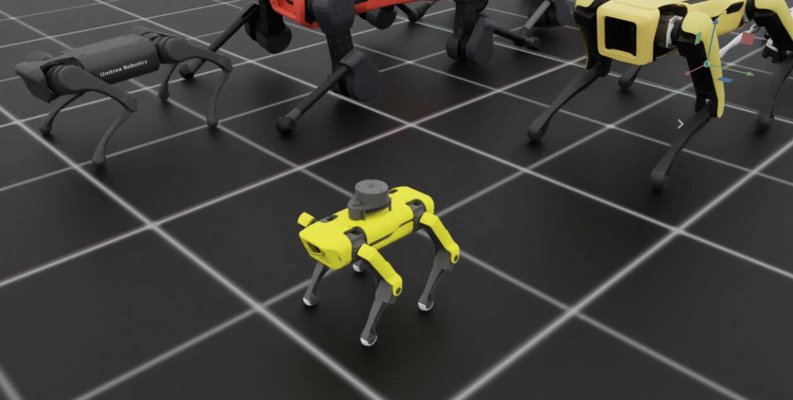

# SpotMicro-IsaacLab



## Converting XACRO to URDF and Importing to Isaac Sim

To import the SpotMicro robot into Isaac Sim, we first need to convert the XACRO files to URDF format, then convert that to USD format. Here's how:

1. Install required packages:
   ```bash
   sudo apt install ros-humble-xacro
   ```

2. Generate URDF from XACRO:
   ```bash
   # Navigate to the URDF generation script
   cd ./spot_micro_rviz/urdf/
   
   # Run the generation script
   ./gen_urdf.sh
   ```
   This will create a URDF file from the robot's XACRO description.

3. Import URDF to Isaac Sim:
   - Open Isaac Sim
   - Go to "File > Import"
   - Select the generated URDF file
   - Configure import settings as needed
   - Click "Import" to create the USD file

The robot should now be available as a USD file that can be used in Isaac Sim simulations.

